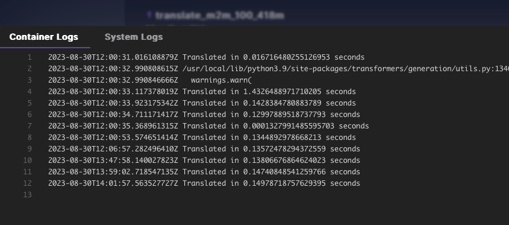

[](https://github.com/leandroalbero/serverless-runpod-translate/actions/workflows/pull-request.yaml)
# serverless-runpod-translate
Service to be run on a serverless runpod.ai instance to translate messages from any language to any language (english by default).
We are using `m2m_100_418m`, this is a many-to-many model. Metrics on performance are TBD.
Model is cached on the docker image.

## Requirements
* A dockerhub account
* A runpod.ai account
* If you want to use the GA to upload to dockerhub, add the following secrets to GH:
  * DOCKER_PASSWORD
  * DOCKER_USERNAME

## Usage
Check [the wiki](https://github.com/leandroalbero/serverless-runpod-translate/wiki) for more detailed information
1. Upload the container image to dockerhub (you can use the GA) and then add it as a template to your runpod.ai account.
Alternatively, you can use my image: `leandroalbero/serverless-runpod:latest`
2. Create an API on runpod.ai serverless section, add as many servers as you need and customize the settings to your needs.
3. Call the runsync endpoint with the following payload, don't forget to authenticate with your API key (Bearer token):
```json
{
    "input":{
        "src_lang":"es",    # Optional, defaults to auto-detected
        "target_lang":"en", # Optional, defaults to EN
        "input_text":"Hola mundo, esta es una frase en castellano"
    }
}
```
A response will be returned with the translated text to english:
```json
{
    "delayTime": 96,
    "executionTime": 84,
    "id": "sync-d14c2348-19b5-44dd-9657-1995146d2f49",
    "output": {
      "translated_text": "building 8 stories",
      "translation_time": 0.0007581710815429688, 
      "uses_gpu": True
    },
    "status": "COMPLETED",
}
```

## Development
... TODO

## Testing results


